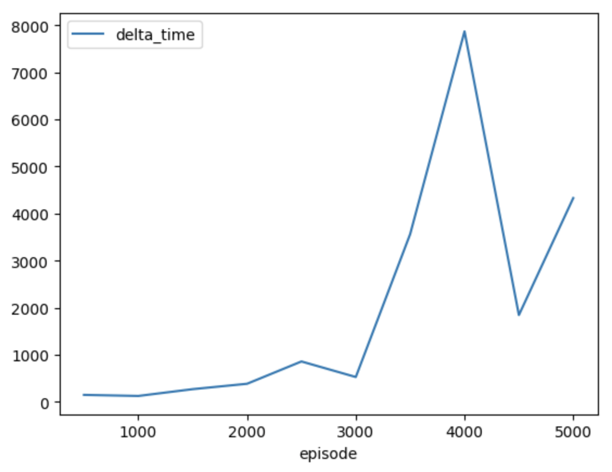

[//]: # (Image References)

[scores_100]: ./images/training_avg_every_100_episodes.png "100 Episode Average Scores"
[scores_all]: ./images/training_1_4000.png "All Scores"

# Report

This report details the algorithm used to solve the Udacity nano-degree Unity Tennis environment with relevant performance metrics and ideas for future work.

## Training Code

The code used to train the `ddpg_agent.py` agent which uses the deep neural net model architectures defined in `model.py` is provided in `Tennis.ipynb`.  The saved model weights for checkpoints after a varying number of episodes have been completed are provided for every 500 episodes 500 through 5000 in the `checkpoints` directory.  The `Tennis.ipynb` shows that while two agents were instantiated in a list to simplify the code for commanding actions in the Unity environment, these agents were actually the same agent and thus both sides of the game were played by the exact same agent with shared memory.  This seemed like a rational arangement as both agents in the game are attempting to cooperate with eachother and thus by sharing experience and actually using the same agent, the agents could likely train faster.

## Learning Algorithm

The learning algorthm used to solve this environment was a Deep Deterministic Policy Gradient (DDPG) with experience replay with local target policy and value networks and soft updates to the target network every 20 steps.  Updating the target network 10 times every 20 steps allows us to decouple the local network training from the target network training and in provides better stability in training.

## Model Architecture

The agent itself used two a fully connected deep neural nets defined in [model.py](./model.py) whose networks for the actor and critic were defined as shown below.  We used a relatively high hidden latent space (with respect to the number of degrees of freedom in the observation space) to allow the algorithm to learn complex relationships as the non-linear trigonometric relationships which tie the states together in the robotic arm would need significant numbers of DOF's to be able to accurately represent the motions needed.  While the agent was able to solve the environment, a smaller number of hidden units could likely have solved the environment as well and this optimization was left to a future exercise. The hidden layers used a ReLU activation functions and the final output layer which mapped to the two available continuous action dimensions did not have any additional shaping functions applied.  The number of nodes in each layer of this network are as shown below.

The actor network is a straight deep neural network mapping the observation space to the action space while the critic network injects the actions selected into the second layer of the network, concatinated with the output of the first network to ensure that the critic network combines both the states and actions being taken in the assignment of the value of any given state-action pair a given point in time.


```
Actor(
  (fc1): Linear(in_features=24, out_features=400, bias=True)
  (fc2): Linear(in_features=400, out_features=300, bias=True)
  (fc3): Linear(in_features=300, out_features=2, bias=True)
)
```

```
# Note that the fc2 layer of the critic has 402 input features since 
# the  action features are inserted into the critic in this second layer.
Critic(
  (fcs1): Linear(in_features=24, out_features=400, bias=True)
  (fc2): Linear(in_features=402, out_features=300, bias=True)
  (fc3): Linear(in_features=300, out_features=1, bias=True)
)
```

## Hyperparameters

For training, the agent used the following hyper parameters:

```
BUFFER_SIZE = int(1e6)  # replay buffer size
BATCH_SIZE = 128        # minibatch size
GAMMA = 0.99            # discount factor
TAU = 1e-3              # for soft update of target parameters
LR_ACTOR = 1e-4         # learning rate of the actor 
LR_CRITIC = 1e-3        # learning rate of the critic
WEIGHT_DECAY = 0        # L2 weight decay
UPDATE_EVERY = 20       # update the target network every X steps
```

The `UPDATE_EVERY` parameter was used to update the networks every 20 timesteps in order to decouple the local and target network training and ensure stability. 

The `BATCH_SIZE` of 128 was the default batch size which seemed to work on the CPU on a local machine and seemed to work well for training fairly quickly on the CPU within a few thousand episodes.

## Training

The agent solved the environment sometime in between the 3000th and 3500th episode.

Checkpoints for each training iteration are found in the [checkpoints](./checkpoints) directory.

One interesting item which significantly slowed down progression of episodes later on in training is that the agents performance increased.  Due to an increase in performance, each episode lasted longer and thus the later episodes and groupings of 500 episodes have a significant increase in the number of samples saved in memory.  For instance, in the first 500 episodes, only 20242 time steps were taken and stored in memory, while betwen episode 2500 and 3000, more than 51000 time steps were added. 

Sometime between episode 3000 and 3500, the agent solved the environment and the number of timesteps (and timesteps per episode) increased significantly.  The affect of this is to naturally provide a statistical bias for replay for learning for games which were played later in the training evolution where the agent is behaving well.  It is important to note that the converse of this is also true.  If the environment were a maze and good performance results in fewer time steps, the practitioner may need to adjust strategies or rewards to properly weight rewards of behaviors by good agents which solve the maze quickly vs bad agents which took a long time to overcome this bias in number of points sampled and assignment of weights on importance of the data will become increasingly important.

## Agent Performance & Plot of Rewards

Performance of the agent in the environment at varied checkpoints are shown below.  

Examples of how various checkpoints of the agent performs after different checkpoints are found in the [videos](./videos) directory.  As the episodes increase, it can be seen that the agent's performance in this collaborative game improves.

Average scores every 500 episodes:

&nbsp;&nbsp;&nbsp;&nbsp;&nbsp;&nbsp;&nbsp;&nbsp;&nbsp;&nbsp;&nbsp;&nbsp;&nbsp;&nbsp;&nbsp;&nbsp;&nbsp;


Note that the time it takes to collect 500 episode seems strongly correlated to the the average score.  This makes sense since if there is a high score, an episode takes longer to play out.

&nbsp;&nbsp;&nbsp;&nbsp;&nbsp;&nbsp;&nbsp;&nbsp;&nbsp;&nbsp;&nbsp;&nbsp;&nbsp;&nbsp;&nbsp;&nbsp;&nbsp;


We can see that the highest performance is attained at Episode 3500 and if we watch the video from that checkpoint, indeed it does seem to perform better than the other checkpoints.  Interestingly, later checkpoints had lower scores and this drop in performance coincided with maxing out the replay buffer memory.  The implementation of the replay buffer in this agent uses a simple `deque` object to keep track of examples and purges old data when the buffer is full.  The curious thing about this model is that once the model starts to play well, then the early poor performance examples are purged and are no longer available for further training.  As such, the model seems to over train on good examples and forgets what bad behavior is and bad behavior such as fast twitching motions resurface once these old examples are purged.  A smarter method of keeping data in the replay buffer based upon it's dissimilarity ot other data is recommended for future investigation.

Log of training progress:
```
Episode 500 	Average Score: 0.0682	 Memory Size: 20242 	Elapsed Time: 150.1885 sec
Episode 1000	Average Score: 0.0159	 Memory Size: 37074 	Elapsed Time: 277.6089 sec
Episode 1500	Average Score: 0.0828	 Memory Size: 72854 	Elapsed Time: 549.4054 sec
Episode 2000	Average Score: 0.1120	 Memory Size: 123066	Elapsed Time: 935.6939 sec
Episode 2500	Average Score: 0.4073	 Memory Size: 228334	Elapsed Time: 1795.4472 sec
Episode 3000	Average Score: 0.1251	 Memory Size: 289536	Elapsed Time: 2325.0231 sec
Episode 3500	Average Score: 1.8176	 Memory Size: 633440	Elapsed Time: 5889.3029 sec
Episode 4000	Average Score: 1.3567	 Memory Size: 1000000	Elapsed Time: 13757.3752 sec
Episode 4500	Average Score: 0.4269	 Memory Size: 1000000	Elapsed Time: 15602.6458 sec
Episode 5000	Average Score: 0.7377	 Memory Size: 1000000	Elapsed Time: 19932.3672 sec
```

## Ideas for Future Work

In the future, it would be good to investigate different models with several different features.  Suggestions include:

* Investigate how we can keep the examples of bad behavior from old iterations in the replay buffer such that the agent does not completely forget what bad behavior is and thus starts to revert to some bad behavior as shown by the drop in performance after the replay buffer is filled up.
* In this report, we only show training on one agent in collaborative play.  It would be interesting to create a new environment and then train agents in a zero-sum or competitive environment and investigate how training setup and progression varies with this type of a challenge.  Next up will be training the soccer environment (which is a competitive environment) to see if a single agent or multiple agents work well.  Likely would need one agent per "personna" for instance if you wanted to have a defender and a forward soccer player.  
* Try different numbers of units for hidden layers.  As noted above, the number of units for hidden layers was relatively high with respect to the observation and action space.  It would be a good exercise to determine the minimum number of hidden units / network size to attain desired performance and solve the environment. 
* Try different types of non-linear activation functions.  Note that classical robotic arm control leverages transformation matricies of trigonometric functions.  If we know that the physical entity that the agent is attempting to control is a robotic arm with articulated joints, it may be beneficial to pick a non-linear activation function which could replicate this behavior instead of attempting to curve fit smooth trigonometric functions with differentialy discontinuous ReLU functions.  While simple, ReLU likely requires a much higher number of units.
* It is known that training may not always go according to plan and it would be beneficial to have a reliable way to restart training at a desired checkpoint without losing progress.  To this end two items should be investigated.  First of all, how should we serialize the entire state of the training which includes current hyper parameters, replay buffer state, training progress metrics (i.e. scores vs episode), in addition to the actor and critic network weights.  Secondly, it would be interesting to investigate which of the hyper parameters and replay buffer state plays a bigger role in losing progress when training is restarted without saving these as state parameters.  That insight would likely provide additional information as to what is important to consider when creating an agent which can have stable training.
* Investigate if there is an optimal number of steps between retrainings of the target network.  
